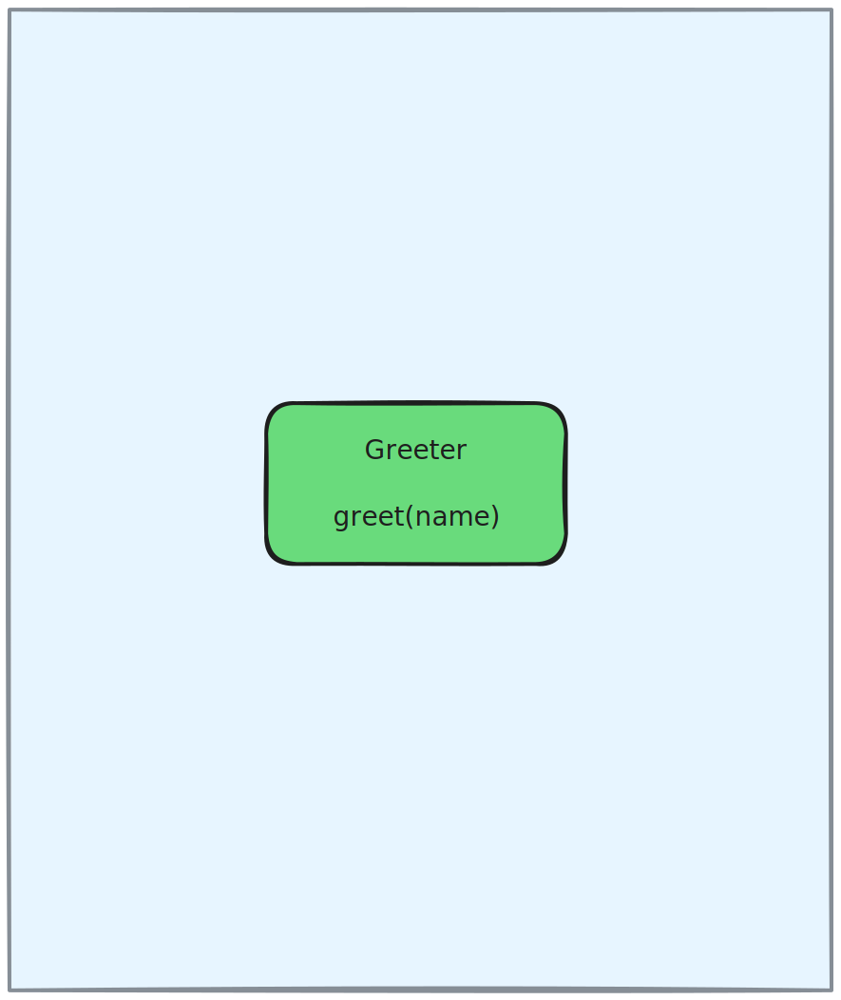
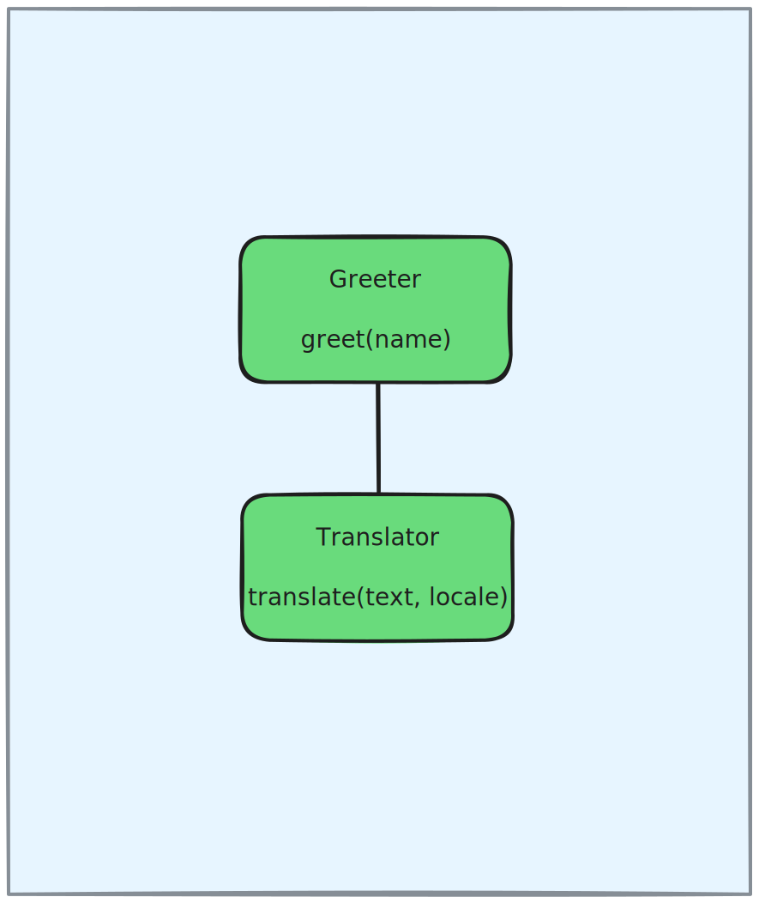
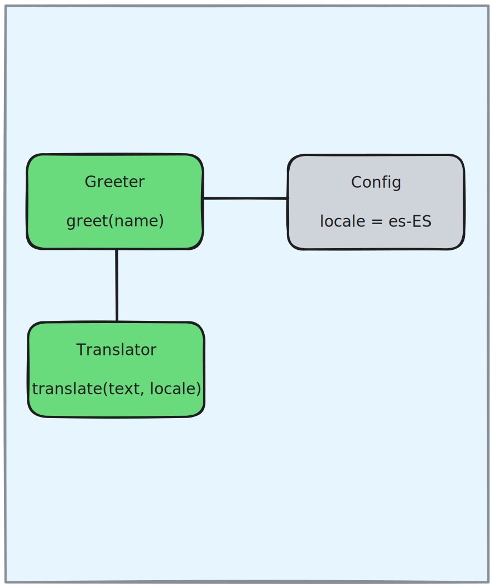
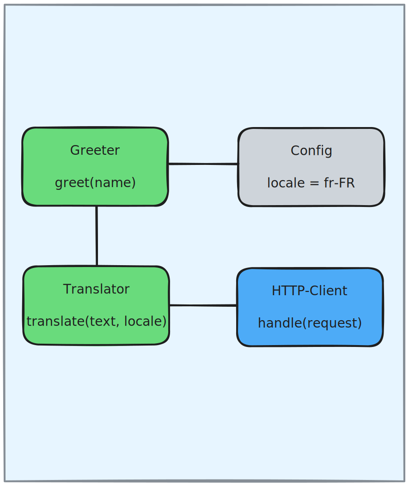
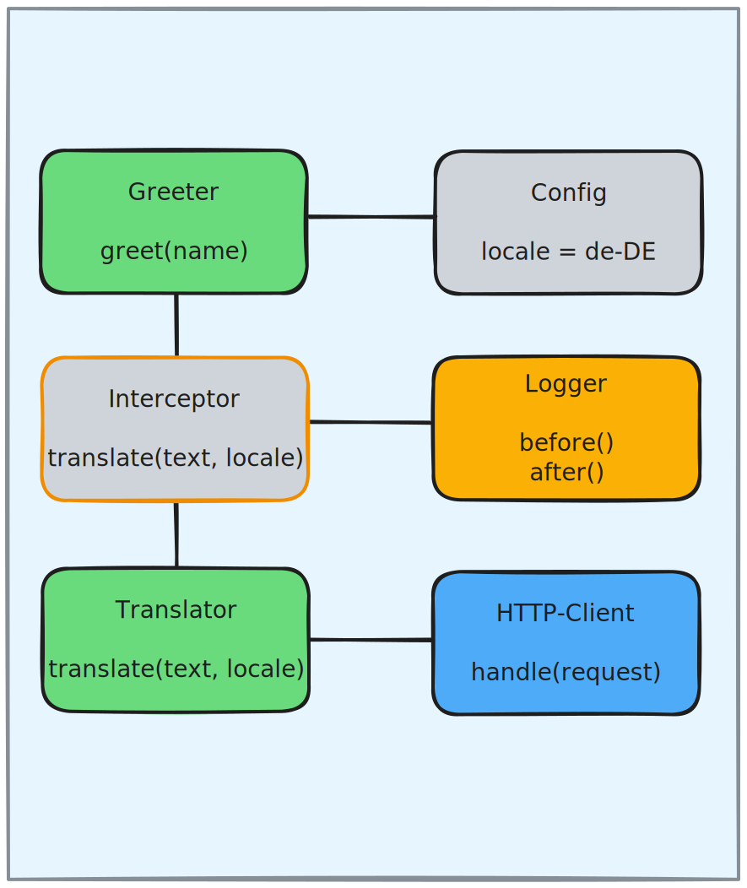
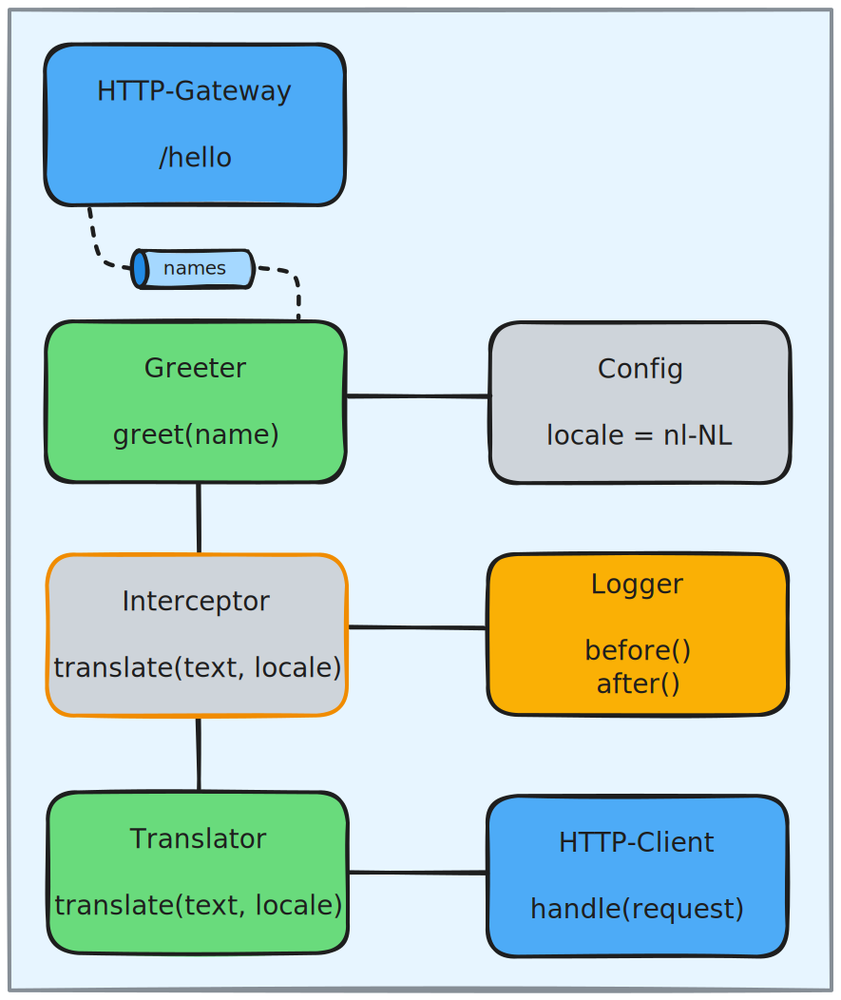
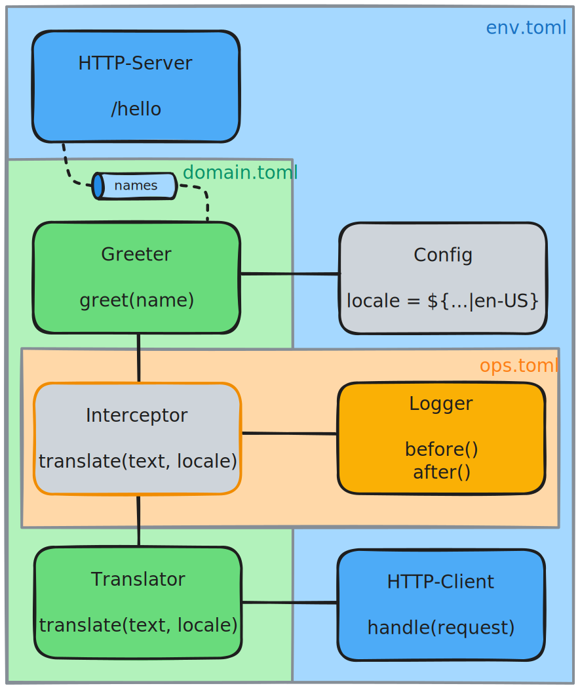

# Sailing the 7 Cs of Composable Runtime

A step-by-step tutorial that builds up a composable system incrementally. Each step adds one key concept from the Composable Runtime model. All of the configuration files for this example are in the [configs](configs) sub-directory.

## Prerequisites

- [Rust](https://rustup.rs/) and `rustup target add wasm32-unknown-unknown`
- [cargo-component](https://github.com/bytecodealliance/cargo-component)
- [wkg](https://github.com/bytecodealliance/wasm-pkg-tools)
- Node.js (for examples 4–7, which use a mock translate API)
- The `composable` CLI (run `cargo install --path .` in this repo's root)

```sh
cd examples/7cs
./build.sh        # compiles the wasm components
./run.sh <1-7>    # runs the specified example
```

---

## 1. Component

<table><tr>
<td width="40%" valign="top">



</td>
<td>

A single Wasm Component, declared by name with a path to its `.wasm` file. The runtime will instantiate the component per-invocation and will run it within an isolated sandbox where it has no capabilities by default. The uri may include a file path as shown or a [Wasm OCI artifact](https://tag-runtime.cncf.io/wgs/wasm/deliverables/wasm-oci-artifact/).

Of course, this initial version of our greeter simply returns: "Hello, World!"

</td>
</tr></table>

```toml
[component.greeter]
uri = "./lib/simple-greeter.wasm"
```

```
$ ./run.sh 1
"Hello, World!"
```

---

## 2. Composition

<table><tr>
<td width="40%" valign="top">



</td>
<td>

A second component is added and injected into the first as an import. The runtime composes them at startup. Their interfaces are explicit and strict: they cannot provide any functionality other than what they declare as exports, and they cannot call out to anything other than their imports. Thus, neither of these components yet has any way to interact with external systems... no files, no network, no I/O, not even clocks or random number generators.

But the greeter can now delegate to a translator with self-contained logic, passing 'haw-US' as the locale. This version of the translator is intentionally simplistic, translating just the word "Hello" across a handful of language codes: de, es, fr, haw, or nl.

</td>
</tr></table>

```toml
[component.greeter]
uri = "./lib/translating-greeter.wasm"
imports = ["translator"]

[component.translator]
uri = "./lib/simple-translator.wasm"
```

```
$ ./run.sh 2
"Aloha, World!"
```

---

## 3. Configuration

<table><tr>
<td width="40%" valign="top">



</td>
<td>

The `config.*` properties on a component definition are used by the runtime to generate a `wasi:config/store` component at startup. That generated component is then injected into the component whose configuration it provides, just like if you were to create a `wasi:config/store` component manually and add it as an "import". No other component, even within the same composition, can see those config values. Sharing between components is limited to whatever is explicitly passed across the import/export boundary.

The greeter now reads its locale from configuration instead of hardcoding it.

</td>
</tr></table>

```toml
[component.greeter]
uri = "./lib/configured-greeter.wasm"
imports = ["translator"]
config.locale = "es-ES"

[component.translator]
uri = "./lib/simple-translator.wasm"
```

```
$ ./run.sh 3
"Hola, World!"
```

---

## 4. Capability

<table><tr>
<td width="40%" valign="top">



</td>
<td>

Host capabilities provide the interfaces a component needs to interact with the external world. For example, the `wasi:http` capability enables a component to make outgoing HTTP requests.

The translator is now replaced with one that calls an external HTTP API. The `translate-api.js` implementation is slightly less simplistic as it also knows how to translate "World" into the same handful of languages.

</td>
</tr></table>

```toml
[component.greeter]
uri = "./lib/configured-greeter.wasm"
imports = ["translator"]
config.locale = "fr-FR"

[component.translator]
uri = "./lib/capable-translator.wasm"
imports = ["http-client"]

[capability.http-client]
type = "wasi:http"
```

```
$ ./run.sh 4
"Bonjour, le Monde!"
```

---

## 5. Cross-Cutting Concerns

<table><tr>
<td width="40%" valign="top">



</td>
<td>

The `interceptors` list accepts components that export *and* import the same exports as the target component (so they can wrap each function call), but it also accepts generic advice that has no awareness of any specific target exports. In the latter case, the runtime generates the interceptor component and composes it with the generic advice and the specific target. This is essentially [Aspect-Oriented Programming for Wasm Components](../../crates/interceptor/). The "logging-stdout" component is defined in the shared `infra.toml` file.

The interceptor generated from logging-advice now wraps the translator and logs before (with args) and after (with the return value) each invocation of the translate function.

</td>
</tr></table>

```toml
[component.greeter]
uri = "./lib/configured-greeter.wasm"
imports = ["translator"]
config.locale = "de-DE"

[component.translator]
uri = "./lib/capable-translator.wasm"
imports = ["http-client"]
interceptors = ["logger"]

[component.logger]
uri = "./lib/logging-advice.wasm"
imports = ["logging-stdout"]

[capability.http-client]
type = "wasi:http"
```

```
$ ./run.sh 5
... [interceptor]: Before translate(text: "Hello, World!", locale: "de-DE")
... [interceptor]: After translate -> "Hallo, Welt!"

"Hallo, Welt!"
```

---

## 6. Channel

<table><tr>
<td width="40%" valign="top">



</td>
<td>

An HTTP gateway accepts incoming requests and consults its configured routes. Each route indicates whether to invoke a specific component + function (where path segments can map to arg names) or to publish to a channel, as shown in this example.

The greeter subscribes to the "names" channel and is invoked when messages arrive. Rather than calling `composable invoke`, this example and the next start the HTTP Gateway via the binary from the [gateway-http](../../crates/gateway-http/) sub-crate and then use `curl` to POST a request.

</td>
</tr></table>

```toml
[gateway.api]
type = "http"
port = 8080

[gateway.api.route.hello]
path = "/hello"
channel = "names"

[component.greeter]
uri = "./lib/configured-greeter.wasm"
imports = ["translator"]
config.locale = "nl-NL"
subscription = "names"

[component.translator]
uri = "./lib/capable-translator.wasm"
imports = ["http-client"]
interceptors = ["logger"]

[component.logger]
uri = "./lib/logging-advice.wasm"
imports = ["logging-stdout"]

[capability.http-client]
type = "wasi:http"
```

```
$ ./run.sh 6
POST /hello with body 'World':

```

The gateway logs the result asynchronously:

```
... [interceptor]: Before translate(text: "Hello, World!", locale: "nl-NL")
... [interceptor]: After translate -> "Hallo, Wereld!"

... composable_runtime::messaging::activator: invocation complete component=greeter function=greet result="Hallo, Wereld!"
```

---

## 7. Collaboration

<table><tr>
<td width="40%" valign="top">



</td>
<td>

Finally, the single config file is split into domain, env, and ops files. Each could be owned by a different team or role based on responsibilities. But more importantly, this decouples the configuration of domain components from the capabilities and infrastructure that may vary across environments.

Notice the greeter can now be configured with a `LOCALE` env var or fallback to a default.

</td>
</tr></table>

**domain.toml**:

```toml
[component.greeter]
uri = "./lib/configured-greeter.wasm"
imports = ["translator"]
config.locale = "${process:env:LOCALE|en-US}"
subscription = "names"

[component.translator]
uri = "./lib/capable-translator.wasm"
imports = ["http-client"]
interceptors = ["logger"]
```

**env.toml**:

```toml
[gateway.api]
type = "http"
port = 8080

[gateway.api.route.hello]
path = "/hello"
channel = "names"

[capability.http-client]
type = "wasi:http"
```
**ops.toml**:

```toml
[component.logger]
uri = "./lib/logging-advice.wasm"
imports = ["logging-stdout"]
```

And finally, the shared `infra.toml` used for examples 4-7:

```toml
[component.logging-stdout]
uri = "./lib/wasi-logging-to-stdout.wasm"
imports = ["wasip2"]

[capability.wasip2]
type = "wasi:p2"
```

```
$ LOCALE=fr ./run.sh 7
POST /hello with body 'World':

```

```
... [interceptor]: Before translate(text: "Hello, World!", locale: "fr")
... [interceptor]: After translate -> "Bonjour, le Monde!"

... composable_runtime::messaging::activator: invocation complete component=greeter function=greet result="Bonjour, le Monde!"
```

---

## Conclusion

As the completed example shows, the Composable Runtime enables environment-aware late-binding and a collaborative deployment model. That is possible because Wasm Components:

1. have strict and explicit interface-based contracts
2. are stored as architecture-agnostic artifacts that can be shared via OCI registries
3. can be generated, composed, and instantiated with negligible latency

A domain team can change component wiring without modifying infrastructure. An ops team can add cross-cutting interceptors without modifying domain logic. A platform team can curate and configure the capabilities that will be available wherever the components land.

> [!NOTE]
> The ability to support collaboration in highly dynamic environments will be increasingly important as AI agents become collaborators across each of these roles with varying degrees of autonomy.

The Composable Runtime also defines an extensibility model that will support additional host capabilities, interceptors, and gateways. The existing functionality has been built upon that same model.

For more detail on specific concepts (messaging, interceptors, extensibility, etc), explore the other [examples](../).
